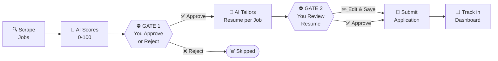

<div align="center">

# 🤖 Job Agent — How to Use

**From zero to your first application in under 15 minutes.**

[README](README.md) · [Full Reference](docs/USER_GUIDE.md) · [Setup Guide](docs/SETUP.md) · [API Docs](docs/API.md)

</div>

---

## How it works



> [!IMPORTANT]
> Nothing ever auto-submits. Every application must pass through **both** human gates — you approve the job at Gate 1, and you approve the tailored resume at Gate 2. You are always in control.

---

## Before you start

Make sure these are all true before continuing:

- [ ] All three services are running: **backend** (port 8000), **Celery worker**, **frontend** (port 3000)
- [ ] Docker Desktop is running with healthy `postgres` and `redis` containers
- [ ] At least one API key is set in `.env` — either `ANTHROPIC_API_KEY` or `GEMINI_API_KEY`
- [ ] You can open [http://localhost:3000](http://localhost:3000) without an error

> [!TIP]
> If you haven't set up the app yet, start with [docs/SETUP.md](docs/SETUP.md). Come back here once all three services are running.

<details>
<summary><b>Starting all three services (quick reference)</b></summary>

Open **three separate terminal windows** and run one command in each:

**Terminal 1 — Backend API**
```bash
# From jobagent_code/backend/
source ../.venv/bin/activate       # macOS/Linux
# ..\.venv\Scripts\activate        # Windows

alembic upgrade head               # first time only
uvicorn app.main:app --reload --port 8000
```

**Terminal 2 — Celery Worker**
```bash
# From jobagent_code/backend/
source ../.venv/bin/activate       # macOS/Linux
# ..\.venv\Scripts\activate        # Windows

celery -A app.core.celery_app worker --pool=solo --loglevel=info
```

**Terminal 3 — Frontend**
```bash
# From jobagent_code/frontend/
npm run dev
```

You should see `http://localhost:3000` open in your browser once all three are ready.

</details>

---

## Step 1: Create your account

1. Open [http://localhost:3000](http://localhost:3000) — you'll see the login page
2. Click **"Sign up"** at the bottom of the login form
3. Enter your email address and a password (minimum 8 characters, must include at least one number)
4. Click **"Create account"** — you'll be logged in automatically and land on the dashboard

> [!NOTE]
> Your account is local to this running instance. It is not connected to any external service.

---

## Step 2: Set up your profile

Go to **Settings** in the left sidebar. The AI uses everything in your profile when scoring jobs and generating resumes — a detailed profile means dramatically better results.

> [!IMPORTANT]
> Set up your full profile **before** running the agent for the first time. The AI cannot score jobs accurately without your target roles and skills.

### Target Roles

This is the single most important field. Type each job title you are targeting and press **Enter** after each one. Each title becomes a chip that you can remove later.

```
Software Engineer        ×
Backend Engineer         ×
Python Developer         ×
```

**Be specific.** `Senior Backend Engineer` produces far better scores than just `Engineer`. Add every realistic variation of the role you want — the AI uses these to weight its scoring.

### AI Model

Choose your LLM provider:

| Option | Model | Best for |
|--------|-------|----------|
| **Claude** (recommended) | claude-sonnet-4-6 | Best reasoning quality, most accurate scoring, best resume writing |
| **Gemini** | gemini-2.0-flash | Faster, lower API cost — good for high-volume searches |

Make sure the corresponding key is set in your `.env` file before selecting the provider.

### Default Job Search

These values are used when you click the **"Run Agent"** button in the sidebar — they define your recurring daily search.

| Field | What to enter | Example |
|-------|--------------|---------|
| **Search query** | The job title or keywords to search for | `Python Backend Engineer` |
| **Location** | City, country, or "Remote" | `Remote` or `London, UK` |
| **Job type** | Full-time, Internship, Contract, or Part-time | `Full-time` |
| **Sources** | Which boards to scrape | LinkedIn + Indeed recommended |
| **Results** | How many jobs to fetch per run | `20` is a good starting point |

> [!TIP]
> Set your most common search here — you can always override it with a custom search from the dashboard. The goal is that clicking "Run Agent" every morning just works.

### Job Preferences

| Field | What to enter | Why it matters |
|-------|--------------|----------------|
| **Skills** | Every technology and skill you know | Direct input to scoring — more skills = more matched signals |
| **Salary range** | Min and max you'd accept | Used to filter and score salary-visible jobs |
| **Remote only** | Toggle on if you only want remote | Jobs requiring on-site get scored down significantly |

**For skills — be comprehensive.** Include things you know but rarely use. The AI matches against job requirements, so `Docker, AWS, Redis, PostgreSQL` are all worth listing even if they're secondary skills for you.

Click **"Save Changes"** when done. You'll see a confirmation toast in the bottom-right corner.

---

## Step 3: Add your resume

Go to **Resume** in the left sidebar.

### Option A — Upload a file (recommended)

Drag and drop your resume file onto the upload area, or click **"Browse"** to select a file. Supported formats:

| Format | Notes |
|--------|-------|
| `.pdf` | Most common — text is extracted automatically |
| `.docx` | Word format — full text extraction |
| `.md` | Markdown — used directly, no conversion needed |
| `.txt` | Plain text — use if nothing else is available |

> [!NOTE]
> The AI extracts your resume text and stores it internally as Markdown. This text becomes the template for all tailored resume versions. The original file is not stored — only the extracted text.

### Option B — Paste Markdown directly

Click **"Paste Markdown"** and type or paste your resume in the editor. Use this template as a starting point:

```markdown
# Your Full Name
your.email@example.com | linkedin.com/in/yourname | github.com/yourname

## Summary
2–3 sentences describing who you are, what you specialize in, and what you're looking for.
Keep this honest and factual — the AI will tailor it per job.

## Experience

### Job Title — Company Name (2022–present)
- Specific achievement with a measurable result (e.g., "Reduced API latency by 40%")
- Another achievement — be as specific as possible
- Technology used: Python, FastAPI, PostgreSQL

### Previous Title — Previous Company (2020–2022)
- Achievement with numbers where possible
- Technologies: React, Node.js, AWS

## Skills
**Backend:** Python, FastAPI, Django, Node.js, PostgreSQL, Redis
**Frontend:** React, TypeScript, Next.js
**DevOps:** Docker, GitHub Actions, AWS (EC2, S3, RDS)
**Other:** Git, REST APIs, Agile/Scrum

## Education
B.Sc. Computer Science — University Name, 2020
```

Click **"Save"** after pasting.

> [!TIP]
> The more achievement-focused your base resume, the better the tailored versions will be. Use specific numbers and outcomes. The AI tailors what you give it — it does not invent experience.

> [!WARNING]
> Do not fabricate experience in your base resume. The AI tailors your real experience to fit the job — it does not add experience you don't have.

---

## Step 4: Run your first search

Go to the **Dashboard** (house icon in the sidebar, or click the "Job Agent" logo).

### Using the search bar

Type a job title in the search box at the top of the dashboard. You can:

- Type any job title (e.g., `React Developer`, `Data Engineer`, `Product Manager`)
- Add a location (e.g., `Remote`, `San Francisco`, `Berlin`)
- Click a **preset chip** to instantly configure the search type:

| Preset chip | What it does |
|-------------|-------------|
| 🎓 **Internship** | Targets internship listings specifically |
| 🌱 **Entry Level** | Filters for junior/entry-level roles |
| ⚡ **Senior** | Targets senior/lead positions |
| 🌍 **Remote Only** | Forces location to "Remote" across all boards |
| 📋 **Contract** | Filters for contract roles |
| 🕐 **Part-time** | Targets part-time positions |

Click **"Search"** to start.

### Or use Run Agent

Click **"Run Agent"** in the left sidebar to use your default search configuration from Settings. This is what you'll click every morning for your recurring search.

> [!NOTE]
> After clicking Search or Run Agent, the agent status bar at the top of the dashboard shows live progress. Scraping typically takes **30–120 seconds** depending on how many sources you've selected and the number of results requested.

### What happens during a scrape

1. The scraper contacts each selected job board (LinkedIn, Indeed, Glassdoor, ZipRecruiter, Google Jobs)
2. Jobs are deduplicated — if a job URL was seen in a previous run, it's silently skipped
3. Each new job is scored by the AI (Claude or Gemini) against your profile
4. The status bar shows: `Scraping...` → `Scoring...` → `Paused — review jobs`
5. Once scoring is complete, the pipeline **pauses** and waits for you at Gate 1

> [!TIP]
> Start with **20 results** from 2–3 sources. You can always increase this once you're happy with the quality of results.

---

## Step 5: Review scored jobs (Gate 1)

Go to **Jobs** in the left sidebar. This is where the agent pauses and waits for you.

### Reading a job card

Each card shows:

```
┌─────────────────────────────────────────────────┐
│  Senior Backend Engineer          [Score: 87] 🟢 │
│  Acme Corp · Remote · $140K–$180K               │
│                                                  │
│  "Strong match on Python and FastAPI.            │
│   Missing: Kubernetes, Terraform."              │
│                                                  │
│  [Approve ✓]                    [Reject ✗]      │
└─────────────────────────────────────────────────┘
```

| Score color | Range | Meaning |
|-------------|-------|---------|
| 🟢 Green | 75–100 | Strong match — apply |
| 🟡 Amber | 55–74 | Moderate match — review carefully |
| 🔴 Red | 0–54 | Weak match — likely skip |

### Opening the detail panel

Click anywhere on a job card (not the buttons) to open the **detail panel** on the right side. It shows:

- Full AI assessment and score reasoning
- Matched skills (green checkmarks) — what the AI found in your profile that matches the job
- Missing skills (red X marks) — what the job wants that you don't have listed
- Full job description — the original text from the job board
- Salary, location, and remote status
- Direct link to the original job posting

### Approve or Reject

- Click **"Approve ✓"** on jobs you want to apply for → the AI will generate a tailored resume for each
- Click **"Reject ✗"** on jobs that aren't a fit → they're dismissed from your queue

> [!TIP]
> You don't have to action every job in one session. Approved and rejected jobs are saved immediately. The agent will generate resumes for all approved jobs together when you trigger the next step.

**Good approval heuristics:**
- Score 80+ with a good company? Almost always approve
- Score 65–79? Open the detail panel — if the job description excites you, approve it
- Missing skills that you actually know but forgot to add? Approve, then update your Skills in Settings
- Company on your blacklist, bad location, or role that's clearly wrong? Reject immediately

> [!WARNING]
> The score is a signal, not a verdict. A job scored 62 at a company you love is worth approving. A job scored 91 at a company you'd never work for should be rejected. The score helps you prioritize — you make the call.

---

## Step 6: Review tailored resumes (Gate 2)

After approving jobs, the agent generates a tailored resume for each one and **pauses again**. Go to **Resume** in the sidebar and look for the "Pending Review" section.

### What the AI changes

For each approved job, the AI rewrites your base resume to:

- **Reorder experience bullets** — the most relevant ones surface to the top
- **Emphasize matched skills** — technologies that appear in the job description get more prominent placement
- **Tailor the summary section** — rewritten to directly address what this specific company is looking for
- **Incorporate job-specific keywords** — the exact phrases from the job description that ATS systems scan for
- **Adjust skills section order** — your most relevant skills for this role are listed first

> [!NOTE]
> The AI never invents experience you don't have. It only reshapes and emphasizes what you provided in your base resume.

### Reviewing a draft

For each job with a pending resume, you'll see:

- **Left panel**: The job details (title, company, key requirements)
- **Right panel**: The tailored resume draft in a live Markdown editor

**Read through the entire draft.** Ask yourself:
- Does this sound like me?
- Are there any factual errors or awkward phrasings?
- Is the summary accurate and compelling?
- Did anything get lost that should be highlighted?

### Editing effectively

Edit directly in the text editor. Your edits are automatically saved as preference signals that train the AI to write more like you over time.

**High-impact edits:**
- Fix the summary if it doesn't sound natural
- Adjust bullet points where the AI got the emphasis wrong
- Add a specific achievement the AI downplayed or missed
- Remove anything that doesn't fit this specific role

> [!TIP]
> Even small edits are valuable. Changing a single phrase to better reflect your voice teaches the AI your writing style. After 50+ edits, you can trigger DPO fine-tuning from the **"AI Training"** tab to permanently improve the AI's output.

Click **"Save"** to confirm the resume. The application moves to the submission queue.

> [!IMPORTANT]
> You must click "Save" to confirm each resume. The agent will not submit until you explicitly approve every resume at Gate 2.

---

## Step 7: Applications pipeline

Go to **Applications** in the sidebar. You'll see a Kanban board tracking every application.

### Status columns

| Column | What it means |
|--------|--------------|
| **Draft** | Application created, resume not yet confirmed |
| **Resume Ready** | Resume confirmed, queued for submission |
| **Submitted** | Application submitted via automation |
| **Responded** | Company has responded (you record this manually) |
| **Interview** | Interview scheduled |
| **Offer** | Offer received |
| **Rejected** | Application rejected |

### Recording outcomes

When a company gets back to you — whether that's an interview invite, a rejection email, or an offer — click on the application card and record the outcome:

1. Open the application card
2. Click **"Record Outcome"**
3. Select the result: `Interview`, `Rejected`, `Offer`, or `No Response`
4. Optionally add notes (e.g., the recruiter's name, next steps)
5. Click **"Save"**

> [!IMPORTANT]
> Recording outcomes is how the AI learns what works. Interview signals feed back into the scoring model — the AI gradually learns that applications it scored highly tend to convert, and adjusts future scores accordingly. The more outcomes you record, the smarter the system gets.

---

## Step 8: Analytics

Go to **Analytics** in the sidebar. This page becomes more useful as your application history grows.

### What each chart shows

| Chart / Metric | What to look for |
|---------------|-----------------|
| **Applications by Status** | Bar chart — how your pipeline is distributed right now |
| **Total Applications** | Running count of everything submitted |
| **Interview Rate** | Interviews ÷ applications — target above 15% |
| **Offer Rate** | Offers ÷ applications — benchmark: 2–5% is strong |
| **Applications Over Time** | Line chart — your application cadence week by week |

> [!TIP]
> If your interview rate is below 10%, focus on improving your base resume and being more selective about which jobs you approve. If your approval rate is very high (approving 80%+ of scored jobs), lower your score threshold — you're casting too wide a net.

---

## Daily workflow

Once everything is set up, your daily routine takes about 5–10 minutes:

1. **Click "Run Agent"** in the sidebar — uses your saved default search
2. **Wait 60–120 seconds** while the agent scrapes and scores jobs
3. **Go to Jobs** — review ~20 scored cards, approve the best matches (aim for 3–7 approvals)
4. **Go to Resume** — skim the generated drafts, fix anything that sounds off, click **Save**
5. **Check Applications** — move any cards that received responses, record outcomes

That's it. The agent handles the scraping, scoring, and submission. You handle the judgment calls.

---

## Pro tips

**Get better job scores:**

- Add every skill you know to your profile — the AI can only match what it knows about you. Add `Docker`, `Git`, `REST APIs` even if they're obvious
- Use exact job title strings in Target Roles — `Senior Software Engineer` matches better than `Software Engineer` if that's what you're applying for
- If a good job scored lower than expected, open the detail panel — the "missing skills" list often reveals a skill you have but forgot to list

**Get better resumes:**

- Your base resume quality directly sets the ceiling for tailored versions — invest time making it achievement-focused
- Always edit AI drafts when the summary doesn't sound like you — this is the highest-signal edit you can make
- After 50 edits, go to **Resume → AI Training → Start DPO Training** — the model will permanently improve to match your style

**Build job search momentum:**

- Run the agent every morning before starting work — consistency compounds
- Approve jobs you're 60%+ sure about — you review the resume before it goes out anyway
- Use the 🌍 Remote Only preset if you're open to remote — it expands your pool dramatically
- Keep your Skills list updated — add technologies as you learn them

**Manage your pipeline:**

- Keep the Applications Kanban up to date — stale cards make it hard to track real progress
- Record outcomes as soon as you hear back — don't let this pile up
- If a company takes more than 2 weeks to respond, mark it `No Response` and move on

> [!TIP]
> Set your **default search** to your most frequent search query in Settings. That way "Run Agent" is always one click — no configuration needed each day.

---

## Troubleshooting

<details>
<summary><b>No jobs appearing after the scrape completes</b></summary>

**Diagnosis:**
- The status bar says "Completed" but the Jobs list is empty
- Or the status bar is stuck on "Scraping..."

**Fixes:**

1. Check the Celery worker is running in Terminal 2:
   ```bash
   # You should see this output in the Celery terminal:
   # celery@hostname ready.
   ```
   If it's not running, restart it:
   ```bash
   cd backend
   celery -A app.core.celery_app worker --pool=solo --loglevel=info
   ```

2. Check the backend terminal (Terminal 1) for error messages — look for red text

3. Some job boards rate-limit aggressively. Try reducing "Results per search" to 10 in your search config and running again

4. LinkedIn is the most restrictive — if only LinkedIn is selected, try adding Indeed or Glassdoor

</details>

<details>
<summary><b>Agent status shows "Failed"</b></summary>

**Diagnosis:**
- The status bar at the top shows "Failed" in red
- No jobs appeared, or the run stopped partway through

**Most common causes:**

1. **Missing API key** — the most common cause. Verify your `.env` file:
   ```bash
   # Check the .env file exists and has the key:
   grep ANTHROPIC_API_KEY .env
   # Should show: ANTHROPIC_API_KEY=sk-ant-...
   ```

2. **Invalid or expired API key** — test it directly:
   ```bash
   curl https://api.anthropic.com/v1/messages \
     -H "x-api-key: $ANTHROPIC_API_KEY" \
     -H "anthropic-version: 2023-06-01" \
     -H "content-type: application/json" \
     --data '{"model":"claude-haiku-4-5-20251001","max_tokens":10,"messages":[{"role":"user","content":"hi"}]}'
   ```

3. **Celery worker not running** — if the worker isn't running, tasks queue indefinitely until they time out and show as failed

After fixing the cause, click **"Run Agent"** again — the agent will start a fresh run.

</details>

<details>
<summary><b>Resume generation fails or produces blank output</b></summary>

**Diagnosis:**
- You approved jobs but no resume drafts appear in the Resume tab
- Or a resume draft is empty

**Fixes:**

1. Ensure you've added a base resume in Settings → Resume. The AI needs your base resume as a template — without it, it has nothing to work from

2. Verify your base resume was saved (you should see the text in the editor when you open the Resume page)

3. Check the backend logs for the specific error — look for lines containing `resume_node` or `generate_resume`

4. Try manually regenerating via the API:
   ```bash
   curl -X POST http://localhost:8000/api/v1/resume/{scored_job_id}/generate \
     -H "Authorization: Bearer $TOKEN"
   ```

</details>

<details>
<summary><b>No real-time updates — status bar doesn't change</b></summary>

**Diagnosis:**
- You click "Run Agent" but the status bar stays at "Idle"
- Or it briefly changes to "Running" then stops updating

**The WebSocket connection may have dropped.**

**Fixes:**

1. Refresh the page — the frontend will reconnect automatically
2. Check the backend is running: open `http://localhost:8000/health` — should return `{"status": "ok"}`
3. Check `NEXT_PUBLIC_WS_URL` in `frontend/.env.local` is set to `ws://localhost:8000`
4. If WebSocket keeps failing, the frontend falls back to polling every 5 seconds — status will update, just slower

</details>

<details>
<summary><b>Frontend shows a login loop or keeps redirecting to login</b></summary>

**Diagnosis:**
- You log in, the page redirects, then shows login again
- Or you see 401 errors in the browser developer console

**Fixes:**

1. Clear `localStorage` in your browser:
   - Open developer tools (F12)
   - Go to Application → Storage → Local Storage → `http://localhost:3000`
   - Click "Clear All" or delete the `token` key
   - Refresh and log in again

2. Check the backend is running: `curl http://localhost:8000/health`

3. If the backend returns 401 on token refresh, your JWT has expired or the `SECRET_KEY` changed. Re-login to get a fresh token.

</details>

<details>
<summary><b>Database migration error on first run</b></summary>

**Diagnosis:**
- `alembic upgrade head` fails with an error about missing revisions, connection refused, or extension not found

**Fixes:**

1. **Connection refused** — PostgreSQL container isn't running:
   ```bash
   docker compose --env-file .env -f docker/docker-compose.yml up -d
   docker compose -f docker/docker-compose.yml ps
   # Both postgres and redis should show: Up (healthy)
   ```

2. **pgvector extension missing** — if not using the provided Docker image:
   ```sql
   CREATE EXTENSION IF NOT EXISTS vector;
   CREATE EXTENSION IF NOT EXISTS "uuid-ossp";
   ```

3. **Alembic revision mismatch** — reset and re-apply:
   ```bash
   # From jobagent_code/backend/
   alembic downgrade base
   alembic upgrade head
   ```

</details>

<details>
<summary><b>Celery worker exits immediately on Windows</b></summary>

**Diagnosis:**
- Celery starts but immediately shows an error about `fork` or pool issues on Windows

**Fix:**

Windows requires the `--pool=solo` flag. Make sure your Celery start command is:

```bash
celery -A app.core.celery_app worker --pool=solo --loglevel=info
```

Do not use `--pool=prefork` or `--pool=gevent` on Windows — they are not supported.

Also verify you activated the virtual environment **before** running Celery:
```bash
.venv\Scripts\activate    # Windows
cd backend
celery -A app.core.celery_app worker --pool=solo --loglevel=info
```

</details>

<details>
<summary><b>Scoring looks wrong — all jobs getting similar scores</b></summary>

**Diagnosis:**
- All jobs score between 60–70 regardless of how relevant they are
- Or everything scores very high / very low

**This is usually a profile issue:**

1. **Too few skills listed** — if your skills list is sparse (fewer than 10 items), the AI has few signals to match against. Add every technology you know.

2. **Target roles too vague** — `Engineer` matches everything weakly. Use `Senior Backend Engineer` or `Python Developer` for sharper scoring.

3. **Wrong AI provider selected** — if you selected Gemini but `GEMINI_API_KEY` is not set, the API may be falling back silently. Check the backend logs.

4. Go to **Settings → Job Preferences → Skills**, expand your list significantly, and run the agent again.

</details>

---

## Need more help?

- **Full reference guide**: [docs/USER_GUIDE.md](docs/USER_GUIDE.md) — every feature documented in depth
- **API documentation**: [docs/API.md](docs/API.md) — all endpoints with request/response examples
- **Bug reports**: [github.com/parnish007/jobagent/issues](https://github.com/parnish007/jobagent/issues)
- **Questions & discussion**: [github.com/parnish007/jobagent/discussions](https://github.com/parnish007/jobagent/discussions)
