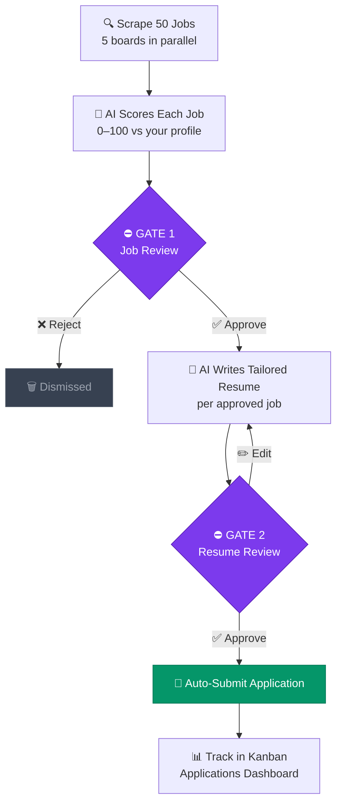
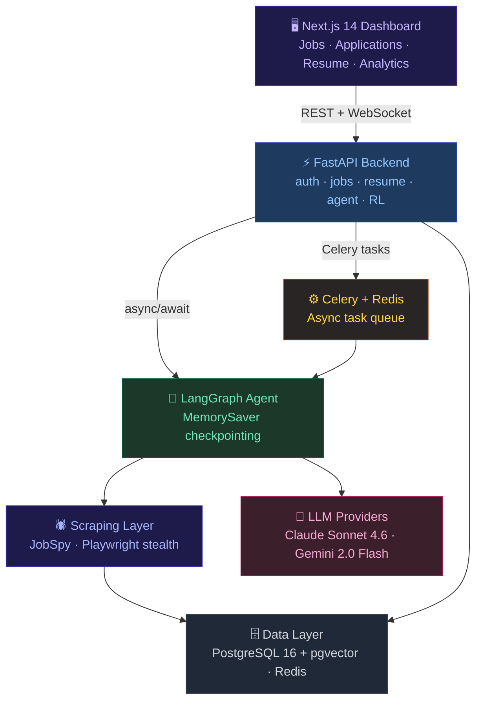
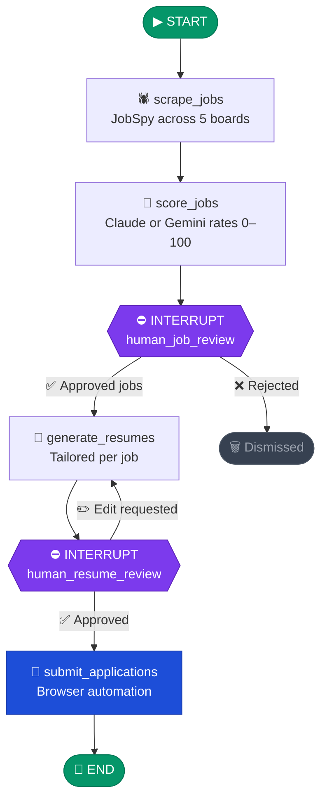

<div align="center">


[](https://git.io/typing-svg)

<br/>

[](https://github.com/parnish007/jobagent/actions/workflows/ci.yml)
[](LICENSE)
[](https://www.python.org/)
[](https://nextjs.org/)
[](https://fastapi.tiangolo.com/)
[](https://langchain-ai.github.io/langgraph/)

<br/>

[**Quick Start**](#quick-start) · [**Architecture**](#architecture) · [**Docs**](docs/SETUP.md) · [**Roadmap**](#roadmap)

</div>

---

## What it does



**Two mandatory human gates.** The agent never submits anything without your explicit approval — not once, not ever.

---

## Features

<details>
<summary><b>🔍 Job Discovery</b></summary>

- **5-board scraping** — LinkedIn, Indeed, Glassdoor, ZipRecruiter, and Google Jobs in a single run
- **AI scoring** — Claude or Gemini rates each job 0–100 against your profile with written reasoning, not just a number
- **Job search presets** — one-click filters for Internship, Entry Level, Senior, Remote, and Contract
- **Target roles** — define exact titles to hunt for; drives both scoring weights and default search queries

</details>

<details>
<summary><b>📄 Resume Generation</b></summary>

- **Tailored resumes** — AI rewrites your base resume per job, matching keywords and tone to each posting
- **Resume upload** — drop in PDF, DOCX, or Markdown; the AI extracts and structures the text for you
- **RL/DPO preference learning** — the AI learns your editing style over time via Direct Preference Optimization (see [RL/DPO Training](#rldpo-training))

</details>

<details>
<summary><b>🛠 Infrastructure</b></summary>

- **Dual LLM support** — switch between Claude (Anthropic) and Gemini (Google) per-user at any time
- **Real-time updates** — WebSocket-powered agent status with automatic polling fallback
- **LangGraph checkpointing** — the agent persists state via `MemorySaver`; resumes from any checkpoint after a server restart
- **MCP server** — exposes all agent tools via Model Context Protocol for composability with other AI systems
- **Dark dashboard** — Next.js 14 UI with Kanban pipeline, analytics, and a built-in resume editor

</details>

---

## Tech stack

| Layer | Technology |
|-------|-----------|
| Frontend | Next.js 14, TypeScript, Tailwind CSS, React Query, Zustand |
| Backend | FastAPI, SQLAlchemy 2.0 (async), Pydantic v2, Alembic |
| Agent runtime | LangGraph with MemorySaver checkpointing |
| LLMs | Claude Sonnet 4.6 (Anthropic) + Gemini 2.0 Flash (Google) |
| Scraping | JobSpy (5 boards) + Playwright with stealth mode |
| Database | PostgreSQL 16 + pgvector |
| Task queue | Celery + Redis |
| ML / RL | sentence-transformers, HuggingFace TRL (DPO) |
| MCP | FastMCP |

---

## Quick start

> **Full setup guide**: [docs/SETUP.md](docs/SETUP.md) · **First-time user guide**: [HOW_TO_USE.md](HOW_TO_USE.md)

### Prerequisites

- Python 3.12+
- Node.js 20+
- Docker + Docker Compose v2
- An API key for **one** of: [Anthropic (Claude)](https://console.anthropic.com/) *(recommended)* or [Google AI Studio (Gemini)](https://aistudio.google.com/)

---

### Step 1 — Clone and configure

```bash
git clone https://github.com/parnish007/jobagent.git
cd jobagent/jobagent_code

cp .env.example .env
```

Open `.env` and set at minimum:

```env
ANTHROPIC_API_KEY=sk-ant-...    # get from console.anthropic.com
SECRET_KEY=<random-32-chars>    # generate: python -c "import secrets; print(secrets.token_hex(32))"
```

---

### Step 2 — Install Python dependencies

```bash
# Run from jobagent_code/
python -m venv .venv

source .venv/bin/activate        # macOS / Linux
# .venv\Scripts\activate         # Windows

pip install -r requirements.txt
playwright install chromium --with-deps
```

---

### Step 3 — Start infrastructure

```bash
docker compose --env-file .env -f docker/docker-compose.yml up -d

# Verify both containers are healthy:
docker compose -f docker/docker-compose.yml ps
```

---

### Step 4 — Run migrations and start the API *(Terminal 1)*

```bash
cd backend
alembic upgrade head
uvicorn app.main:app --reload --port 8000
# API → http://localhost:8000
```

---

### Step 5 — Start the Celery worker *(Terminal 2)*

```bash
# From jobagent_code/
source .venv/bin/activate
cd backend
celery -A app.core.celery_app worker --pool=solo --loglevel=info
```

> **Windows:** `--pool=solo` is required. macOS/Linux can use `--pool=prefork -c 4` for parallelism.

---

### Step 6 — Start the frontend *(Terminal 3)*

```bash
cd frontend
cp ../.env.example .env.local
npm install
npm run dev
# Dashboard → http://localhost:3000
```

---

### Step 7 (Optional) — Start the MCP server *(Terminal 4)*

```bash
cd mcp_server
python server.py
# No extra install — packages are already in requirements.txt
```

---

## First use

1. Open [http://localhost:3000](http://localhost:3000) → **Sign up**
2. Go to **Settings** → fill in Target Roles, Skills, AI provider, and default search
3. Go to **Resume** → upload a PDF/DOCX or paste Markdown → click **Save**
4. Back on **Dashboard** → click **Run Agent** or type a search → hit **Search**
5. In the **Jobs** tab: review AI-scored cards, **Approve** or **Reject** each one
6. In the **Resume** tab: review the tailored draft per approved job, edit if needed, click **Save**
7. Track everything in **Applications** (Kanban) and **Analytics**

---

## Architecture



### Agent graph



State is persisted via `MemorySaver` — the agent resumes from any checkpoint if the server restarts mid-run.

---

## RL/DPO training

Job Agent collects preference signals passively and uses **Direct Preference Optimization** to improve future resume generation to match your style.

| Signal | When it's recorded |
|--------|-------------------|
| `edit` | You edit an AI-generated resume — the edited version is marked preferred |
| `explicit_rating` | You thumbs-up or thumbs-down a resume in the UI |
| `outcome` | An application receives an interview response |

Once 50+ preference pairs are collected, go to **Resume → AI Training** and click **Start DPO Training**.

---

## Configuration

All environment variables are documented in [`.env.example`](.env.example). Key variables:

```env
# Required (at least one LLM provider)
ANTHROPIC_API_KEY=sk-ant-...      # console.anthropic.com
GEMINI_API_KEY=...                # aistudio.google.com

# Required
SECRET_KEY=<random-32-chars>

# Optional
DEFAULT_LLM_PROVIDER=claude       # claude | gemini
ENVIRONMENT=development           # development | production
BRIGHT_DATA_API_KEY=...           # proxy rotation for scraping at scale
LANGFUSE_PUBLIC_KEY=...           # agent observability and tracing
```

---

## Contributing

Read [CONTRIBUTING.md](CONTRIBUTING.md) first, then:

- **Bug reports** → [open an issue](https://github.com/parnish007/jobagent/issues/new?template=bug_report.md)
- **Feature requests** → [open an issue](https://github.com/parnish007/jobagent/issues/new?template=feature_request.md)
- **Pull requests** → follow the [PR template](.github/PULL_REQUEST_TEMPLATE.md)

---

## Security

Found a vulnerability? **Do not open a public issue.** See [SECURITY.md](SECURITY.md) for the responsible disclosure process.

---

## Roadmap

<details>
<summary><b>View full roadmap</b></summary>

**Shipped**
- [x] Multi-board scraping (LinkedIn, Indeed, Glassdoor, ZipRecruiter, Google Jobs)
- [x] AI job scoring with Claude and Gemini
- [x] Tailored resume generation per job
- [x] Resume upload (PDF, DOCX, Markdown)
- [x] Target roles chip UI
- [x] Human approval gates (jobs and resumes)
- [x] Browser automation for form submission
- [x] Real-time WebSocket agent status
- [x] Job search presets
- [x] RL/DPO preference learning

**Planned**
- [ ] Workday / Greenhouse / Lever ATS support
- [ ] Email and Slack notifications for high-score matches
- [ ] Browser extension for one-click job capture
- [ ] Multi-user / team mode
- [ ] Production deployment guide

</details>

---

## License

MIT © 2026 — see [LICENSE](LICENSE) for details.

<div align="center">


*Built to remove the tedium from job hunting — not the human.*

[](https://github.com/parnish007/jobagent)

</div>