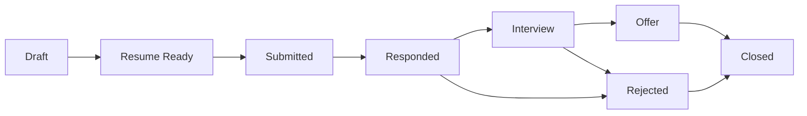

<div align="center">

# 📖 Job Agent — User Guide

**Complete reference documentation for every feature.**

[← README](../README.md) · [Quick Start Guide](../HOW_TO_USE.md) · [API Reference](API.md) · [Architecture](ARCHITECTURE.md)

</div>

---

## Table of Contents

1. [Dashboard overview](#1-dashboard-overview)
2. [Settings reference](#2-settings-reference)
   - [Target Roles](#21-target-roles)
   - [AI Model selection](#22-ai-model-selection)
   - [Default Job Search](#23-default-job-search)
   - [Job Preferences](#24-job-preferences)
3. [Job search deep dive](#3-job-search-deep-dive)
   - [Search presets](#31-search-presets)
   - [Advanced options](#32-advanced-options)
   - [Job board comparison](#33-job-board-comparison)
   - [Scrape timing and deduplication](#34-scrape-timing-and-deduplication)
4. [Job scoring explained](#4-job-scoring-explained)
   - [How the AI scores 0–100](#41-how-the-ai-scores-0100)
   - [Score factors and weights](#42-score-factors-and-weights)
   - [Improving your score distribution](#43-improving-your-score-distribution)
5. [Resume generation deep dive](#5-resume-generation-deep-dive)
   - [What the AI does](#51-what-the-ai-does)
   - [Writing a strong base resume](#52-writing-a-strong-base-resume)
   - [Editing strategies](#53-editing-strategies)
6. [The RL/DPO training loop](#6-the-rldpo-training-loop)
   - [Signal types](#61-signal-types)
   - [Accumulating pairs efficiently](#62-accumulating-pairs-efficiently)
   - [Running DPO training](#63-running-dpo-training)
   - [What changes after training](#64-what-changes-after-training)
7. [Applications tracking](#7-applications-tracking)
   - [Status lifecycle](#71-status-lifecycle)
   - [Recording outcomes](#72-recording-outcomes)
   - [The feedback loop](#73-the-feedback-loop)
8. [Analytics explained](#8-analytics-explained)
9. [MCP server](#9-mcp-server)
10. [API quick reference](#10-api-quick-reference)
11. [Power user tips](#11-power-user-tips)
12. [Full settings reference table](#12-full-settings-reference-table)
13. [Troubleshooting reference](#13-troubleshooting-reference)

---

## 1. Dashboard overview

The dashboard is your home base at [http://localhost:3000](http://localhost:3000). Here's every element explained:

### Top bar

| Element | Description |
|---------|-------------|
| **Agent status badge** | Shows the current pipeline state: `Idle`, `Running`, `Paused`, `Completed`, or `Failed`. Updates in real time via WebSocket. |
| **Current step label** | More granular state — e.g., `Scraping jobs...`, `Scoring 18 jobs...`, `Awaiting job review`. |
| **Notification bell** | Alerts for completed runs, failed tasks, or outcomes requiring attention. |
| **User menu** | Account settings and logout. |

### Stats row

Four summary cards below the top bar:

| Card | What it counts |
|------|----------------|
| **Pending Review** | Jobs that have been scored and are waiting for your Approve/Reject decision |
| **Applications Sent** | Total applications submitted across all time |
| **Interviews** | Applications that reached the Interview stage |
| **Match Rate** | Percentage of scored jobs you approved (your selectivity signal) |

### Find Jobs panel

The search interface on the dashboard. Contains:
- **Search box** — free-text job title or keyword
- **Location box** — city, country, or "Remote"
- **Preset chips** — one-click search type modifiers (see [Section 3.1](#31-search-presets))
- **Advanced button** — expands the source selector and results count
- **Search button** — triggers the scrape pipeline

### Jobs to Review section

Below the search panel, this section shows your current queue of scored jobs. Cards appear here after each scrape completes. The section is empty when no jobs are pending review.

### Sidebar

| Item | Route | Purpose |
|------|-------|---------|
| **Dashboard** | `/` | Stats + search + pending review queue |
| **Jobs** | `/jobs` | Full job review queue with filtering |
| **Applications** | `/applications` | Kanban pipeline of all submitted applications |
| **Resume** | `/resume` | Base resume editor + AI-generated drafts + training tab |
| **Analytics** | `/analytics` | Charts and pipeline metrics |
| **Settings** | `/settings` | All user configuration |
| **Run Agent** button | — | Triggers full pipeline with default search config |

---

## 2. Settings reference

Settings are accessible at `/settings` in the sidebar. All changes are saved per-user in the database.

### 2.1 Target Roles

**Location:** Settings → Target Roles

The most important setting in the entire system. This drives two things:

1. **Scoring weights** — jobs matching your target titles receive a significant scoring boost
2. **Default search** — if no explicit search query is set, the first target role is used as the default query

**How to use:** Type a job title and press **Enter**. Each title becomes a removable chip. Add as many as you need.

**Best practices:**
- Be specific — `Senior Backend Engineer` outperforms `Engineer`
- Add all realistic variations — `Python Developer`, `Backend Developer`, `API Engineer` all catch different listings
- Include level variants if you're open to them — `Software Engineer`, `Senior Software Engineer`
- Remove titles you're no longer targeting to keep scoring focused

> [!TIP]
> If you notice good jobs consistently scoring below 70, the most likely fix is adding more specific target role variants. The title match is one of the strongest scoring signals.

### 2.2 AI Model selection

**Location:** Settings → AI Model

| Provider | Model ID | Speed | Cost | Quality |
|----------|----------|-------|------|---------|
| **Claude** (Anthropic) | `claude-sonnet-4-6` | Medium | Medium | Best overall — recommended for both scoring and resume generation |
| **Gemini** (Google) | `gemini-2.0-flash` | Fast | Low | Good for scoring at scale; resume quality slightly lower than Claude |

The selected provider is used for **all AI operations**: job scoring, resume generation, and any future AI features. You can switch providers at any time — the change takes effect on the next agent run.

**API key requirements:**
- Claude: `ANTHROPIC_API_KEY` must be set in your `.env`
- Gemini: `GEMINI_API_KEY` must be set in your `.env`

Both keys can be set simultaneously — the setting controls which one is actively used.

### 2.3 Default Job Search

**Location:** Settings → Default Job Search

These values power the **"Run Agent"** button. When you click "Run Agent", the pipeline uses exactly these parameters — no additional configuration required.

| Field | Type | Default | Description |
|-------|------|---------|-------------|
| **Search query** | Text | First target role | Job title or keywords sent to job boards |
| **Location** | Text | `Remote` | City, region, country, or "Remote" |
| **Job type** | Select | `Full-time` | Full-time, Part-time, Contract, Internship |
| **Sources** | Multi-select | LinkedIn + Indeed | Which job boards to scrape |
| **Results per run** | Number | `20` | How many listings to fetch per source |

> [!NOTE]
> "Results per run" applies per source — selecting 3 sources with results=20 fetches up to 60 total jobs (minus duplicates). Start at 20 and adjust based on your review capacity.

### 2.4 Job Preferences

**Location:** Settings → Job Preferences

| Field | Type | Default | Description |
|-------|------|---------|-------------|
| **Skills** | Tag input | — | All skills you possess — used for skill matching in scoring |
| **Minimum salary** | Number | — | Jobs below this threshold are scored down |
| **Maximum salary** | Number | — | Upper bound (rarely a filter, but useful for contract rates) |
| **Remote only** | Toggle | Off | When on, on-site-only jobs receive a significant score penalty |
| **Auto-approve threshold** | Number | `85` | Jobs scoring above this auto-approve (future feature — currently informational) |
| **Daily application limit** | Number | `10` | Maximum applications the system will submit per calendar day |

---

## 3. Job search deep dive

### 3.1 Search presets

Presets are chip buttons in the search bar that instantly modify the search parameters. They can be combined:

| Preset | Parameters it sets | Use case |
|--------|-------------------|----------|
| 🎓 **Internship** | `job_type=internship` | Current students or career changers |
| 🌱 **Entry Level** | Appends "entry level" to query | First job or career change |
| ⚡ **Senior** | Appends "senior" to query | 5+ years experience roles |
| 🌍 **Remote Only** | `location=Remote` | Location-independent search |
| 📋 **Contract** | `job_type=contract` | Freelance or fixed-term roles |
| 🕐 **Part-time** | `job_type=part-time` | Reduced hours positions |

**Combining presets example:** Clicking 🌍 Remote Only + ⚡ Senior produces a search for senior-level remote roles at whatever title you typed in the search box.

> [!TIP]
> The "Remote Only" preset is particularly powerful — it unlocks positions across all geographies. If you're open to remote work, always include it to expand your pool.

### 3.2 Advanced options

Click **"Advanced"** in the search bar to expose:

**Source selector** — checkboxes for each job board:

| Board | Notes |
|-------|-------|
| **LinkedIn** | Largest pool; most restrictive rate limits |
| **Indeed** | Broad coverage; generally reliable |
| **Glassdoor** | Strong for company culture context; moderate limits |
| **ZipRecruiter** | US-focused; most permissive scraping |
| **Google Jobs** | Aggregates from many sources; no rate limit issues |

**Results per search** — slider from 5 to 50. Controls how many listings are fetched per selected source.

> [!NOTE]
> Running without a proxy (`BRIGHT_DATA_API_KEY` not set) works well for personal use at 10–30 results per source per day. Higher volumes may trigger temporary rate limiting from LinkedIn specifically.

### 3.3 Job board comparison

| Board | Listing volume | Remote listings | Salary visibility | Rate limit risk |
|-------|---------------|-----------------|-------------------|-----------------|
| LinkedIn | Very high | Excellent | Low (must click through) | High |
| Indeed | High | Good | Medium | Low |
| Glassdoor | Medium | Good | High (salary estimates) | Medium |
| ZipRecruiter | Medium | Good | Medium | Very low |
| Google Jobs | Very high | Good | Varies by source | Very low |

**Recommended starting combo:** LinkedIn + Indeed + Google Jobs. This covers the widest range with manageable rate limit risk.

### 3.4 Scrape timing and deduplication

**Timing:** Each scrape takes 30–120 seconds depending on:
- Number of sources selected (each source adds ~15–30 seconds)
- Results requested (more results = longer scrape)
- Job board response times (LinkedIn is typically slowest)
- Whether a proxy is configured

**Deduplication:** Every job URL is SHA-256 hashed into a `fingerprint` column before storage. If a job appears in multiple scrapes (common for long-running listings), it is silently skipped the second time. This means:
- Running the agent daily is safe — you won't see the same jobs twice
- You can safely change your search query between runs — overlapping results are automatically filtered
- Deduplication is per-user — two users can both see the same job independently

---

## 4. Job scoring explained

### 4.1 How the AI scores 0–100

Every job is scored by the same AI prompt that receives:
- Your **target roles** list
- Your **skills** list
- Your **salary preferences**
- Your **location preferences** (remote only flag)
- The full **job title, company, location, and description** (truncated to 3,000 characters)

The AI returns a structured JSON response:
```json
{
  "score": 87,
  "reasoning": "Strong match on Python and FastAPI. Missing Kubernetes.",
  "matched_skills": ["Python", "FastAPI", "PostgreSQL", "Docker"],
  "missing_skills": ["Kubernetes", "Terraform"]
}
```

The score is a holistic 0–100 rating — not a formula. The AI weighs all factors together and reasons about fit the way a recruiter would.

### 4.2 Score factors and weights

While the AI doesn't publish exact weights, these factors consistently drive scores up or down:

**Strong positive signals:**
- Job title closely matches one of your Target Roles (high weight)
- Many skills overlap between your profile and job requirements
- Location matches your preference (especially remote vs. on-site)
- Salary range aligns with your preference

**Moderate positive signals:**
- Company/industry you've expressed interest in
- Experience level appropriate to your background
- Technology stack you're familiar with

**Negative signals:**
- Requires relocation to a location you haven't listed
- Salary well below your minimum
- Requires skills you've explicitly flagged as missing from your profile
- Job type mismatch (e.g., contract when you want full-time)

### 4.3 Improving your score distribution

**If all scores are clustered between 60–75:**
- Your skills list is likely too sparse — add every technology you know
- Your target roles may be too generic — use more specific titles

**If everything scores above 85:**
- Your profile is very well-matched to the market, or
- Your target roles are too broad — tighten them to your real target level

**If everything scores below 50:**
- Your skills may not match the job market for your target roles
- Try searching for different role types or check that your skills list is comprehensive
- Verify the correct AI provider is selected and the API key is working

> [!TIP]
> A healthy score distribution should have roughly: 20% above 80 (strong approve), 40% between 60–79 (review carefully), 40% below 60 (generally reject). If your distribution is very different, adjust your profile or search terms.

---

## 5. Resume generation deep dive

### 5.1 What the AI does

When you approve a job, the AI receives:
- Your complete base resume text
- The full job description (up to 3,000 characters)
- The list of **matched skills** from the scoring phase
- The job title, company name, and location

It then produces a tailored version using this prompt strategy:

1. **Summary rewrite** — the opening summary is rewritten to directly address what this company is looking for, using language from the job description
2. **Experience reordering** — within each role, bullets are reordered to surface the most relevant achievements first
3. **Keyword integration** — terminology from the job description is naturally incorporated (not keyword-stuffed) to improve ATS compatibility
4. **Skills section reordering** — the skills most relevant to this specific role are listed first
5. **Tone calibration** — for startups, language becomes more agile and direct; for enterprise roles, more formal

The AI has an explicit constraint: **it never invents experience you don't have.** It reshapes and reframes your real experience — it does not fabricate.

### 5.2 Writing a strong base resume

The quality of your base resume sets the absolute ceiling for every tailored version. A strong base resume has:

**Quantified achievements:**
```markdown
# Weak
- Worked on API performance improvements

# Strong
- Reduced API p99 latency from 800ms to 120ms by rewriting the database query layer
```

**Specific technologies called out inline:**
```markdown
# Weak
- Built backend services

# Strong
- Built async REST APIs using FastAPI + SQLAlchemy 2.0, deployed on AWS ECS
```

**Complete skills coverage:**
- Include every technology you know, even secondary skills
- Organize by category: Backend, Frontend, DevOps, Databases, etc.
- The AI uses this list as the raw material for keyword matching

**Honest, accomplishment-focused bullets:**
- Use past tense for previous roles, present for current
- Start bullets with strong action verbs: Built, Reduced, Designed, Led, Migrated
- Include numbers wherever possible (users, requests/day, latency, team size, revenue impact)

### 5.3 Editing strategies

When you review a generated draft, focus your editing energy where it has the highest impact:

**High-impact edits:**
- The summary paragraph — this is the first thing read; if it doesn't sound like you, rewrite it
- The first bullet of your most recent role — most visible position on the resume
- Any claim that's slightly inaccurate — factual precision is critical

**Medium-impact edits:**
- Bullet reordering within a role if the AI chose wrong priorities
- Adding a specific achievement the AI downplayed
- Adjusting tone to better fit the company culture

**Low-impact edits:**
- Fixing minor phrasing
- Capitalization and formatting consistency

> [!TIP]
> Each edit you save is a preference signal. The AI learns from the delta between what it generated and what you kept. Even 10–15 consistent edits across sessions begin to measurably shift the AI's output style.

---

## 6. The RL/DPO training loop

Job Agent uses **Direct Preference Optimization (DPO)** to continuously improve resume generation based on your preferences. This section explains how it works in detail.

### 6.1 Signal types

Three types of signals are collected automatically:

| Signal type | When it's recorded | How it's used |
|-------------|-------------------|---------------|
| **`edit`** | You modify an AI-generated resume and save it | The edited version is marked "chosen"; the original is marked "rejected" |
| **`explicit_rating`** | You click thumbs-up or thumbs-down on a resume version | Direct preference signal between two versions |
| **`outcome`** | An application receives an interview response | The resume used is marked "chosen" relative to others for that job type |

Each signal creates a **preference pair**: one "chosen" resume version and one "rejected" resume version. DPO trains the model to generate output closer to the chosen version.

### 6.2 Accumulating pairs efficiently

You need a minimum of **50 preference pairs** before DPO training is worthwhile. Here's how to reach that threshold faster:

**Fastest path — consistent editing:**
- Review and edit every AI draft, even if only small changes
- Focus on making the summary sound more like you — this creates the highest-signal pairs
- Each save of a modified draft creates one pair

**Supplementary — explicit ratings:**
- Go to **Resume → AI Training** and use the thumbs-up/thumbs-down buttons on any past drafts
- If you have two versions of a resume for the same job, rating one preferred creates a pair
- Takes 30 seconds per pair — efficient for catching up when you have a backlog

**Organic signal — recording outcomes:**
- Every time you record an interview outcome, the corresponding resume gets a positive signal
- Record outcomes promptly — don't let them pile up

**View your current progress:** Go to **Resume → AI Training** tab to see:
- Total preference pairs collected
- Progress bar toward 50-pair minimum
- Breakdown by signal type
- Whether a fine-tuned model is currently active

### 6.3 Running DPO training

Once you have 50+ pairs:

1. Go to **Resume → AI Training**
2. Click **"Start DPO Training"**
3. Training runs in the background — timing depends on hardware:

| Hardware | Approximate training time |
|----------|--------------------------|
| Modern GPU (RTX 3090, A100) | 15–45 minutes |
| Apple Silicon (M1/M2/M3) | 45–90 minutes |
| CPU only | 3–8 hours |

4. The status updates in the AI Training tab while training runs
5. Once complete, the fine-tuned model is automatically used for all future resume generation

> [!NOTE]
> DPO training requires additional ML dependencies. If you haven't installed them, the system will prompt you. To install manually: `pip install trl transformers datasets` (plus PyTorch with CUDA if using GPU).

<details>
<summary><b>Running DPO training manually from the command line</b></summary>

```bash
# From jobagent_code/backend/
source ../.venv/bin/activate

python -m app.rl.dpo_trainer --user-id <your-user-uuid>
```

Get your user UUID from the API:
```bash
curl http://localhost:8000/api/v1/auth/me \
  -H "Authorization: Bearer $TOKEN"
# Returns: {"id": "your-uuid", "email": "..."}
```

Training logs are written to `backend/logs/dpo_training_{user_id}_{timestamp}.log`.

</details>

### 6.4 What changes after training

After DPO training completes:

- **All future resume generation** uses the fine-tuned model instead of the base model
- The writing style will be measurably closer to your editing patterns
- Summary sections will more closely match how you write
- Bullet phrasing will reflect your preferred vocabulary and sentence structure

**What does not change:**
- The scoring model (job scoring uses a separate prompt, not a fine-tuned model)
- Your base resume text
- Previously generated drafts (those remain as-is; only new generations use the fine-tuned model)

You can re-run DPO training after accumulating another 50+ pairs to continue improving. Each training run builds on the previous fine-tuned model.

---

## 7. Applications tracking

### 7.1 Status lifecycle

Every application moves through a defined state machine. The Kanban board shows one column per status:



| Status | Meaning | How it's set |
|--------|---------|-------------|
| `draft` | Application record created, resume not yet confirmed | Automatic — when job is approved at Gate 1 |
| `resume_ready` | Resume confirmed at Gate 2, queued for submission | Automatic — when you save the resume at Gate 2 |
| `submitted` | Application has been submitted via Playwright automation | Automatic — after successful form submission |
| `responded` | Company has responded | Manual — you record this when you hear back |
| `interview` | Interview scheduled or completed | Manual |
| `offer` | Offer received | Manual |
| `rejected` | Application rejected | Manual or automatic (if company sends rejection) |
| `closed` | Application closed for any reason | Manual — use to archive stale applications |

### 7.2 Recording outcomes

When you hear back from a company:

1. Go to **Applications**
2. Find the application card (use the search bar if needed)
3. Click **"Record Outcome"**
4. Select the outcome type:

| Outcome | When to use |
|---------|------------|
| `interview` | You've been invited to a phone screen, interview, or technical assessment |
| `rejected` | Explicit rejection email or message received |
| `offer` | Formal offer received (verbal or written) |
| `no_response` | It's been 2+ weeks and you've heard nothing — move on |

5. Optionally add notes: recruiter name, next steps, interview format, offer details
6. Click **"Save"** — the application card moves to the appropriate Kanban column

### 7.3 The feedback loop

Recorded outcomes don't just track your progress — they feed directly back into the AI:

**Interview outcomes → Scoring improvement:**
When an application reaches the `interview` status, the system records which job characteristics led to that success. Over multiple interviews, the scoring model calibrates toward jobs with similar profiles — implicitly improving which jobs get recommended.

**Outcome → RL training data:**
Every `interview` outcome generates a positive preference signal for the resume used in that application (the `outcome` signal type described in Section 6.1). This means getting interviews doesn't just feel good — it literally trains the AI to write more resumes like the one that worked.

> [!IMPORTANT]
> The feedback loop only works if you record outcomes. An unrecorded interview is a missed training signal. Build the habit of updating application status within 24 hours of hearing back.

---

## 8. Analytics explained

The Analytics page (`/analytics`) visualizes your job search pipeline. Each chart and metric is defined here:

### Summary metrics row

| Metric | Formula | What a healthy value looks like |
|--------|---------|--------------------------------|
| **Total Applications** | Count of all applications ever submitted | Grows steadily — 3–5 per week is a healthy pace |
| **Interview Rate** | `interview count ÷ submitted count × 100` | Above 15% is strong; below 10% suggests resume issues |
| **Offer Rate** | `offer count ÷ submitted count × 100` | 2–5% is strong; above 8% is excellent |
| **Avg. Days to Response** | Mean of `days_to_response` across all recorded outcomes | Below 14 days typically indicates high-demand roles |

### Applications by Status (bar chart)

Shows the current distribution of all applications across status columns. This is a snapshot of your pipeline right now.

**What to look for:**
- A large `submitted` pile with zero `responded` — either it's early, or you need to follow up
- Growing `interview` column — positive signal; keep the momentum
- High `rejected` / `submitted` ratio — investigate resume quality or job selection criteria

### Applications Over Time (line chart)

Weekly count of applications submitted. Useful for tracking consistency.

**What to look for:**
- Flat weeks followed by spikes — inconsistent search strategy; aim for steady weekly output
- Declining trend — a reminder to re-engage with the daily workflow

### Interview Rate Over Time (line chart)

Your interview-to-application rate week by week. This is the most important trend line.

**What to look for:**
- Upward trend — the AI is learning your preferences and your resume quality is improving
- Flat line — consider adding more preference signals or editing resumes more aggressively
- Sudden drop — check if your search criteria changed, or if you started applying to less-matched roles

> [!TIP]
> Analytics become meaningful after ~20 applications. In the first week, the charts will be sparse. The longer you use Job Agent consistently, the more actionable the trends become.

---

## 9. MCP server

Job Agent includes a **FastMCP server** that exposes the agent's core operations as Model Context Protocol tools. This enables Job Agent to be used as a building block in larger AI workflows.

### Starting the MCP server

```bash
# From jobagent_code/mcp_server/
python server.py
```

The server runs on its default port and is immediately usable by MCP-compatible clients.

### Available tools

| Tool name | Description | Key parameters |
|-----------|-------------|----------------|
| `scrape_jobs` | Trigger a job scrape for a user | `user_id`, `search_query`, `location`, `sites`, `results_wanted` |
| `score_job` | Score a single job against a user profile | `user_id`, `job_id` |
| `generate_resume` | Generate a tailored resume for an approved job | `user_id`, `scored_job_id` |
| `get_user_profile` | Fetch a user's full profile and preferences | `user_id` |
| `update_job_status` | Approve or reject a scored job | `job_id`, `status` (`approved`/`rejected`) |
| `record_outcome` | Log an application outcome | `application_id`, `outcome` |
| `list_pending_jobs` | List all jobs awaiting review for a user | `user_id` |

### Connecting to Claude Desktop

Add this to your Claude Desktop MCP configuration:

**macOS:** `~/Library/Application Support/Claude/claude_desktop_config.json`
**Windows:** `%APPDATA%\Claude\claude_desktop_config.json`

```json
{
  "mcpServers": {
    "jobagent": {
      "command": "python",
      "args": ["/absolute/path/to/jobagent_code/mcp_server/server.py"]
    }
  }
}
```

After adding this config and restarting Claude Desktop, you can use natural language to interact with your Job Agent pipeline:

> "List my pending jobs and approve the ones above 80"
> "Generate a resume for the top-scored job in my queue"
> "Record that I got an interview for my most recent application"

> [!NOTE]
> The MCP server shares the same database as the main application. Operations performed via MCP are immediately reflected in the dashboard.

---

## 10. API quick reference

Base URL: `http://localhost:8000/api/v1`

All endpoints except `/auth/register` and `/auth/login` require:
```
Authorization: Bearer <access_token>
```

Interactive docs with full request/response schemas: `http://localhost:8000/docs`

For the complete API reference, see [API.md](API.md).

### Authentication

| Method | Path | Description |
|--------|------|-------------|
| `POST` | `/auth/register` | Create new account |
| `POST` | `/auth/login` | Login and get access token |
| `GET` | `/auth/me` | Get current user details |

### Jobs

| Method | Path | Description |
|--------|------|-------------|
| `GET` | `/jobs` | List scored jobs (filter by `?status=pending_review`) |
| `POST` | `/jobs/{id}/approve` | Approve a job (moves to resume generation queue) |
| `POST` | `/jobs/{id}/reject` | Reject a job |
| `POST` | `/jobs/scrape` | Trigger a scrape with custom parameters |

### Applications

| Method | Path | Description |
|--------|------|-------------|
| `GET` | `/applications` | List all applications |
| `POST` | `/applications/{id}/submit` | Trigger submission for a ready application |
| `POST` | `/applications/{id}/outcome` | Record interview/rejection/offer outcome |

### Resume

| Method | Path | Description |
|--------|------|-------------|
| `GET` | `/resume` | Get base resume text |
| `PUT` | `/resume` | Update base resume text |
| `GET` | `/resume/{job_id}/draft` | Get the tailored draft for a specific job |
| `POST` | `/resume/{job_id}/generate` | Trigger resume generation for an approved job |
| `POST` | `/resume/preference` | Record an explicit preference signal (for RL training) |

### Agent

| Method | Path | Description |
|--------|------|-------------|
| `GET` | `/agent/status` | Get current agent run status and counters |
| `POST` | `/agent/run` | Trigger full pipeline with default config |
| `WS` | `/agent/ws/{user_id}` | Subscribe to real-time agent status events |

---

## 11. Power user tips

**Use the API directly for bulk operations:**

```bash
# Approve all pending jobs scoring above 80
TOKEN="your-token"
curl http://localhost:8000/api/v1/jobs?status=pending_review \
  -H "Authorization: Bearer $TOKEN" | \
  jq '.[] | select(.score > 80) | .id' | \
  xargs -I{} curl -X POST http://localhost:8000/api/v1/jobs/{}/approve \
    -H "Authorization: Bearer $TOKEN"
```

**Watch agent progress from the terminal:**

```bash
# Subscribe to the WebSocket stream and pretty-print events
TOKEN="your-token"
USER_ID=$(curl -s http://localhost:8000/api/v1/auth/me \
  -H "Authorization: Bearer $TOKEN" | jq -r '.id')

websocat "ws://localhost:8000/api/v1/agent/ws/$USER_ID" | jq .
```

**Trigger a scrape without touching the UI:**

```bash
curl -X POST http://localhost:8000/api/v1/jobs/scrape \
  -H "Authorization: Bearer $TOKEN" \
  -H "Content-Type: application/json" \
  -d '{
    "search_query": "Staff Engineer",
    "location": "Remote",
    "sites": ["linkedin", "indeed"],
    "results_wanted": 30
  }'
```

**Export all applications to JSON:**

```bash
curl http://localhost:8000/api/v1/applications \
  -H "Authorization: Bearer $TOKEN" > applications_export.json
```

**Run the DPO trainer on-demand:**

```bash
cd backend
python -m app.rl.dpo_trainer --user-id $(curl -s http://localhost:8000/api/v1/auth/me \
  -H "Authorization: Bearer $TOKEN" | jq -r '.id')
```

**Keep your skills list updated automatically:**
- After every interview, note the technologies they asked about
- After every rejection, check the job description for skills you don't have listed
- Add new skills to Settings immediately — they take effect on the next scrape

---

## 12. Full settings reference table

All user-configurable settings, their defaults, allowed values, and where they live:

| Setting | Location | Default | Type | Allowed values | Impact |
|---------|----------|---------|------|----------------|--------|
| `target_titles` | Settings → Target Roles | `[]` | String array | Any text | Job scoring weight; default search |
| `skills` | Settings → Job Preferences | `[]` | String array | Any text | Skill matching in scoring |
| `salary_min` | Settings → Job Preferences | `null` | Integer | Any positive int | Score penalty for below-minimum jobs |
| `salary_max` | Settings → Job Preferences | `null` | Integer | Any positive int | Informational; no hard filter |
| `remote_only` | Settings → Job Preferences | `false` | Boolean | `true`/`false` | Score penalty for on-site jobs |
| `auto_approve_threshold` | Settings → Job Preferences | `85` | Integer | `0`–`100` | Future auto-approve feature threshold |
| `daily_application_limit` | Settings → Job Preferences | `10` | Integer | `1`–`100` | Hard cap on daily submissions |
| `ai_provider` | Settings → AI Model | `claude` | Enum | `claude`, `gemini` | Which LLM powers scoring and generation |
| `default_search_query` | Settings → Default Search | `""` | String | Any text | Used by "Run Agent" button |
| `default_location` | Settings → Default Search | `"Remote"` | String | Any location text | Used by "Run Agent" button |
| `default_job_type` | Settings → Default Search | `"Full-time"` | Enum | `Full-time`, `Part-time`, `Contract`, `Internship` | Used by "Run Agent" button |
| `default_sources` | Settings → Default Search | `["linkedin","indeed"]` | String array | `linkedin`, `indeed`, `glassdoor`, `zip_recruiter`, `google` | Which boards to scrape |
| `default_results_wanted` | Settings → Default Search | `20` | Integer | `5`–`50` | Results per source per run |
| `base_resume_text` | Resume page | `""` | Markdown text | Any Markdown | Template for all tailored resumes |

**Environment-level settings** (set in `.env`, not the UI):

| Variable | Default | Description |
|----------|---------|-------------|
| `ANTHROPIC_API_KEY` | — | Required for Claude |
| `GEMINI_API_KEY` | — | Required for Gemini |
| `SECRET_KEY` | — | JWT signing secret — must be 32+ chars |
| `DEFAULT_MODEL` | `claude-sonnet-4-6` | Model ID for LLM calls |
| `ACCESS_TOKEN_EXPIRE_MINUTES` | `30` | JWT token lifetime |
| `BRIGHT_DATA_API_KEY` | — | Optional — proxy rotation for high-volume scraping |
| `LANGFUSE_PUBLIC_KEY` | — | Optional — agent tracing and observability |
| `DEBUG` | `false` | Enables verbose SQL logging |

For the complete environment variable reference, see [CONFIGURATION.md](CONFIGURATION.md).

---

## 13. Troubleshooting reference

This section is a comprehensive reference. For the most common issues with quick fixes, see [HOW_TO_USE.md — Troubleshooting](../HOW_TO_USE.md#troubleshooting).

<details>
<summary><b>Backend fails to start — asyncpg connection error</b></summary>

**Error:** `asyncpg.exceptions.ConnectionRefusedError: connection to server at "localhost" (127.0.0.1), port 5432 failed`

**Cause:** PostgreSQL container is not running or not yet healthy.

**Fix:**
```bash
# Check container status
docker compose -f docker/docker-compose.yml ps

# If not running, start it
docker compose --env-file .env -f docker/docker-compose.yml up -d

# Wait for healthy status (30–60 seconds for first start)
docker compose -f docker/docker-compose.yml ps
# Should show: Up (healthy)
```

</details>

<details>
<summary><b>alembic upgrade head fails with "target database is not up to date"</b></summary>

**Cause:** A previous partial migration left the database in an inconsistent state.

**Fix:**
```bash
# From jobagent_code/backend/
alembic current          # See what revision the DB is on
alembic history          # See all available revisions

# Option 1: Stamp to a specific revision and continue
alembic stamp <revision_id>
alembic upgrade head

# Option 2: Full reset (destroys all data)
alembic downgrade base
alembic upgrade head
```

</details>

<details>
<summary><b>Celery tasks never execute — status stays "Running" forever</b></summary>

**Cause:** The Celery worker is not running, not connected to Redis, or tasks are queuing but not consuming.

**Diagnosis:**
```bash
# Check if Redis is running
docker compose -f docker/docker-compose.yml ps
# redis should show: Up (healthy)

# Check Redis connectivity
redis-cli -h localhost -p 6379 ping
# Expected: PONG

# Check if worker is running
# (look in Terminal 2 for the Celery worker)
```

**Fix:** If the worker isn't running, start it:
```bash
source .venv/bin/activate   # or .venv\Scripts\activate on Windows
cd backend
celery -A app.core.celery_app worker --pool=solo --loglevel=info
```

If the worker starts but shows no tasks listed under `[tasks]`, verify you're running from the `backend/` directory.

</details>

<details>
<summary><b>Playwright browser automation fails or times out</b></summary>

**Error:** `playwright._impl._errors.Error: Executable doesn't exist at...`

**Fix:**
```bash
# Reinstall Playwright browsers
playwright install chromium --with-deps
```

**Error:** Playwright starts but the job board detects automation and blocks it

**Fixes:**
- The current implementation uses `playwright-stealth` — ensure it's installed (`pip install playwright-stealth`)
- For persistent blocks on LinkedIn, configure `BRIGHT_DATA_API_KEY` for proxy rotation
- Reduce `results_wanted` — lower request volume reduces detection probability

</details>

<details>
<summary><b>WebSocket connection repeatedly drops</b></summary>

**Symptoms:** Agent status flickers, or status bar freezes mid-run.

**Current WebSocket behavior:** The server sends ping events every 2 seconds. Step-complete events are not yet connected to Redis pub/sub (see [API.md](API.md#websocket)). The frontend automatically falls back to 5-second polling if the WebSocket fails.

**Debug:**
```javascript
// In browser developer console
const ws = new WebSocket('ws://localhost:8000/api/v1/agent/ws/YOUR_USER_ID');
ws.onopen = () => console.log('Connected');
ws.onmessage = (e) => console.log(JSON.parse(e.data));
ws.onerror = (e) => console.error('WS Error', e);
ws.onclose = (e) => console.log('Closed', e.code, e.reason);
```

If you see repeated `1006` close codes, the backend is likely restarting due to an error — check Terminal 1 for Python tracebacks.

</details>

<details>
<summary><b>LLM scoring returns inconsistent or nonsensical results</b></summary>

**Symptoms:** All jobs score identically, scores don't match the job description, or scoring fails silently.

**Diagnosis:**
1. Check backend logs for the scorer node — look for lines containing `scorer_node` or `score_jobs`
2. Verify the API key is valid:
   ```bash
   # Test Anthropic key
   curl https://api.anthropic.com/v1/messages \
     -H "x-api-key: $ANTHROPIC_API_KEY" \
     -H "anthropic-version: 2023-06-01" \
     -H "content-type: application/json" \
     --data '{"model":"claude-haiku-4-5-20251001","max_tokens":10,"messages":[{"role":"user","content":"hi"}]}'
   ```
3. Check your API key has sufficient credits — low-credit keys may throttle or return empty responses

**Fix for inconsistent scores:** Check that your Skills and Target Roles in Settings are comprehensive. The scoring prompt quality degrades significantly with sparse profile data.

</details>

<details>
<summary><b>DPO training fails to start or errors out immediately</b></summary>

**Error:** `ModuleNotFoundError: No module named 'trl'`

**Fix:**
```bash
source .venv/bin/activate
pip install trl transformers datasets
# For GPU support, install PyTorch separately:
# https://pytorch.org/get-started/locally/
```

**Error:** Training starts but crashes with CUDA out-of-memory

**Fix:**
```bash
# Reduce batch size in app/rl/dpo_trainer.py
# Find: per_device_train_batch_size=4
# Change to: per_device_train_batch_size=1
```

**Error:** "Not enough preference pairs"

You need 50+ preference pairs before training is meaningful. Check your current count in **Resume → AI Training** and accumulate more signals using the strategies in [Section 6.2](#62-accumulating-pairs-efficiently).

</details>

<details>
<summary><b>Frontend shows "Failed to fetch" for all API calls</b></summary>

**Cause:** Frontend can't reach the backend API.

**Checklist:**
1. Is the backend running? `curl http://localhost:8000/health` should return `{"status":"ok"}`
2. Does `frontend/.env.local` contain `NEXT_PUBLIC_API_URL=http://localhost:8000`?
3. Was `.env.local` present before `npm run dev` started? (Next.js reads it at startup — restart the dev server if you just created it)
4. Are there CORS errors in the browser developer console? If so, check that `CORS_ORIGINS` in the backend config includes `http://localhost:3000`

</details>

<details>
<summary><b>pgvector extension missing — migration fails on job_embeddings table</b></summary>

**Error:** `ProgrammingError: type "vector" does not exist`

**Cause:** The PostgreSQL database doesn't have the `pgvector` extension installed.

**Fix using Docker (recommended):**
The provided Docker Compose uses `pgvector/pgvector:pg16` image which includes the extension, and `docker/init.sql` enables it automatically. If you used a standard postgres image by mistake:

```bash
# Stop containers, remove volumes, restart with correct image
docker compose --env-file .env -f docker/docker-compose.yml down -v
docker compose --env-file .env -f docker/docker-compose.yml up -d
cd backend && alembic upgrade head
```

**Fix using external PostgreSQL:**
```sql
CREATE EXTENSION IF NOT EXISTS vector;
CREATE EXTENSION IF NOT EXISTS "uuid-ossp";
```

Note: `pgvector` must be installed at the OS/PostgreSQL level before this SQL command works. On Ubuntu: `sudo apt install postgresql-16-pgvector`.

</details>

<details>
<summary><b>Application submission always stays in "Draft" status</b></summary>

**Cause:** The Playwright application_node is running but form submission is failing.

**Current state of form automation:** The Playwright submission flow detects LinkedIn Easy Apply and Indeed Quick Apply buttons and initiates the apply flow. Full form-filling (uploading resume PDF, answering screening questions) is incrementally implemented. Complex ATS forms (Workday, Greenhouse, Lever) are on the roadmap.

**What to do for applications that stay in Draft:**
1. Open the application card and click the "View Job" link
2. Submit the application manually using the tailored resume from the Resume tab
3. Come back to the Applications card and manually move it to "Submitted"
4. Record the outcome when you hear back

This is expected behavior for job boards not yet fully supported by the automation layer.

</details>

---

**Need something not covered here?**

- **GitHub Issues** — [github.com/parnish007/jobagent/issues](https://github.com/parnish007/jobagent/issues)
- **GitHub Discussions** — [github.com/parnish007/jobagent/discussions](https://github.com/parnish007/jobagent/discussions)
- **Architecture deep dive** — [ARCHITECTURE.md](ARCHITECTURE.md)
- **Agent system internals** — [AGENTS.md](AGENTS.md)
- **Full configuration reference** — [CONFIGURATION.md](CONFIGURATION.md)
